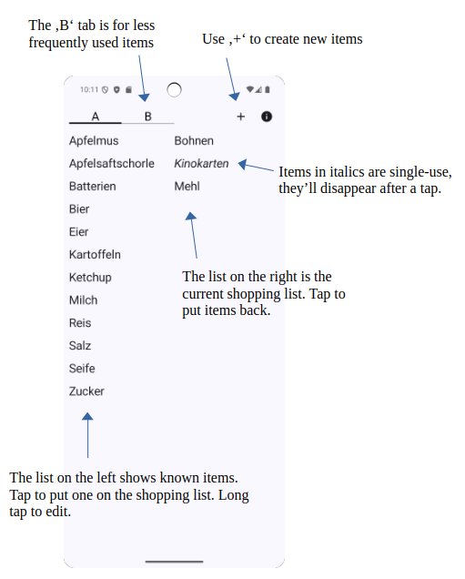
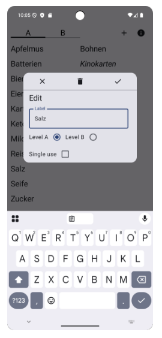

## Einkaufszettel

This is a minimalistic kotlin/jetpack/android app to note down stuff
for your next shopping trip. It can register items in two levels, one
for frequently needed things (like eggs or milk), one for less
frequently needed things (like socks). Registered items can be put on
the actual shopping list with a single tap. There is also support for
remembering one-time things that do not need to be registered
persistently.

The main screen looks like this:

If you long-tap an item the edit dialog shows up:

---
Copyright (C) 2025 Claus Brunzema <mail@cbrunzema.de>

Distributed under the terms of the GNU General Public License, see 
file COPYING
